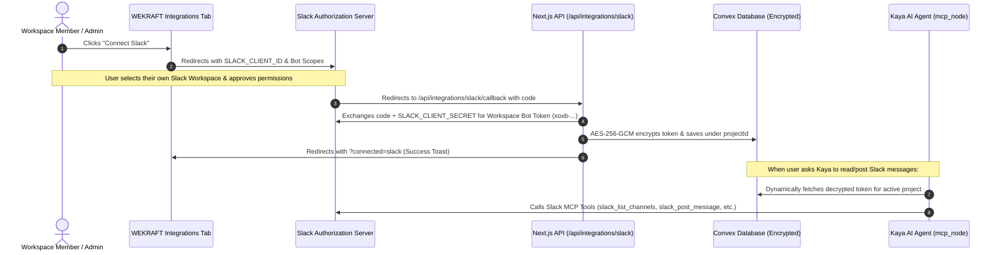

# Slack MCP Integration Guide for WEKRAFT

This document outlines the complete end-to-end setup for connecting Slack with WEKRAFT via the Model Context Protocol (MCP) and Multi-Tenant OAuth 2.0.

---

## 1. Architecture Overview



---

## 2. Slack App Configuration (api.slack.com/apps)

### Step 1: Create the Slack App
1. Navigate to [api.slack.com/apps](https://api.slack.com/apps).
2. Click **Create New App** -> Choose **From scratch**.
3. Set:
   - **App Name**: `WEKRAFT AI`
   - **Pick a workspace to develop your app in**: Select your development workspace (e.g. `WEKRAFT`).
4. Click **Create App**.

---

### Step 2: Configure Redirect URLs
1. In the left sidebar, click **OAuth & Permissions**.
2. Scroll down to **Redirect URLs** and click **Add New Redirect URL**.
3. Add your callback endpoints:
   - **Local Development** (using ngrok or HTTPS tunnel):
     ```
     https://<your-ngrok-subdomain>.ngrok-free.app/api/integrations/slack/callback
     ```
   - **Production**:
     ```
     https://<your-production-domain>.com/api/integrations/slack/callback
     ```
   *(Note: Slack requires an HTTPS URL for public distribution / OAuth redirects).*
4. Click **Save URLs**.

---

### Step 3: Add Bot Token Scopes
On the same **OAuth & Permissions** page, scroll down to **Scopes** -> **Bot Token Scopes** and add:

| Scope | Purpose |
| :--- | :--- |
| `channels:read` | View public channels in the workspace |
| `channels:history` | Read messages and discussion history in public channels |
| `groups:read` | View private channels that the bot is invited to |
| `groups:history` | Read messages in private channels |
| `im:read` | View 1-on-1 direct message conversations |
| `im:history` | Read direct message threads |
| `mpim:read` | View multi-person direct messages |
| `chat:write` | Send messages, updates, and standup summaries to channels |
| `chat:write.public` | Post to public channels without needing an explicit invite |
| `users:read` | View team member profiles and user IDs |

---

### Step 4: Get App Credentials
1. In the left sidebar, click **Basic Information**.
2. Scroll down to **App Credentials**.
3. Copy:
   - **Client ID**
   - **Client Secret** (click *Show* to reveal)

---

### Step 5: Enable Public Distribution (Multi-Tenant)
To allow any WEKRAFT user/organization to connect their own Slack workspace:
1. In the left sidebar, click **Manage Distribution** (or **Distribute App**).
2. Complete the checklist (fill in app description, upload app icon `/slack.png`).
3. Under **Share Your App with Other Workspaces**, click **Activate Public Distribution**.

---

## 3. Environment Variables (.env.local)

Add the copied credentials to `client/.env.local`:

```env
# Slack OAuth Credentials
SLACK_CLIENT_ID="your_slack_client_id_here"
SLACK_CLIENT_SECRET="your_slack_client_secret_here"

# App URL (Must match the base URL of your redirect URI)
NEXT_PUBLIC_APP_URL="https://your-domain.com"
```

---

## 4. Local Testing with HTTPS (ngrok)

Slack requires HTTPS for OAuth redirects. To test locally:
1. Start an HTTPS tunnel with ngrok:
   ```bash
   ngrok http 3000
   ```
2. Copy the HTTPS URL provided by ngrok (e.g. `https://abc-123.ngrok-free.app`).
3. Set `NEXT_PUBLIC_APP_URL="https://abc-123.ngrok-free.app"` in `client/.env.local`.
4. Add `https://abc-123.ngrok-free.app/api/integrations/slack/callback` to **Redirect URLs** in the Slack App dashboard.
5. Restart your client dev server (`npm run dev`) and test connecting Slack!

---

## 5. Supported Kaya MCP Tools for Slack

Once connected, Kaya's `MCP Agent` automatically leverages these tools during chat:

| Tool | Action | Safety Level |
| :--- | :--- | :--- |
| `slack_list_channels` | Lists available public and private workspace channels | Read-only (Auto) |
| `slack_read_channel_history` | Reads latest discussions, blockers, and updates | Read-only (Auto) |
| `slack_list_users` | Resolves team member usernames and emails | Read-only (Auto) |
| `slack_post_message` | Posts standups, sprint summaries, or alerts | Write / Mutation (HITL Protected) |

---

## 6. Verification Checklist

- [ ] Slack App created on `api.slack.com/apps`
- [ ] Redirect URL set with HTTPS protocol
- [ ] 10 Bot Scopes added under OAuth & Permissions
- [ ] Public Distribution enabled
- [ ] `SLACK_CLIENT_ID` and `SLACK_CLIENT_SECRET` saved in `client/.env.local`
- [ ] "Connect" button in `/dashboard/.../integrations` successfully redirects and returns `?connected=slack`
- [ ] Token safely encrypted in Convex `mcpConnections` table

---

# HubSpot MCP Integration Guide for WEKRAFT

Like Slack, **HubSpot does not support Dynamic Client Registration (RFC 7591)**. When connecting directly with standard dynamic MCP discovery, HubSpot returns:
> `Incompatible auth server: does not support dynamic client registration`

To connect HubSpot, you must register a **HubSpot Developer App** and configure static OAuth credentials.

---

## 1. HubSpot App Setup (developers.hubspot.com)

### Step 1: Create a HubSpot Developer Account & App
1. Go to [developers.hubspot.com](https://developers.hubspot.com) and sign in.
2. In your Developer Account, click **Apps** -> **Create App**.
3. Set **App Name** to `WEKRAFT AI`.

---

### Step 2: Configure Redirect URLs
1. Navigate to the **Auth** tab in your app settings.
2. Under **Redirect URLs**, add:
   - **Local Development**:
     ```
     https://<your-tunnel>.ngrok-free.app/api/integrations/hubspot/callback
     ```
   - **Production**:
     ```
     https://<your-domain>.com/api/integrations/hubspot/callback
     ```

---

### Step 3: Configure Required Scopes
In the **Auth** tab under **Scopes**, add the following read/write scopes:

| Scope | Purpose |
| :--- | :--- |
| `crm.objects.contacts.read` | Access CRM contacts and leads |
| `crm.objects.deals.read` | View pipeline deals and sales stages |
| `crm.objects.companies.read` | Read company organization data |
| `crm.objects.deals.write` | (Optional) Create or update deals via Kaya |

---

### Step 4: Get Client ID & Secret
1. In the **Auth** tab, copy:
   - **Client ID**
   - **Client Secret**

---

## 2. Environment Variables (.env.local)

Add to `client/.env.local`:

```env
# HubSpot OAuth Credentials
HUBSPOT_CLIENT_ID="your_hubspot_client_id_here"
HUBSPOT_CLIENT_SECRET="your_hubspot_client_secret_here"
```

---

## 3. Supported Kaya MCP Tools for HubSpot

Once connected, Kaya can query live HubSpot CRM data:
- `hubspot_get_contact`
- `hubspot_list_deals`
- `hubspot_search_companies`
- `hubspot_get_pipeline_stages`
