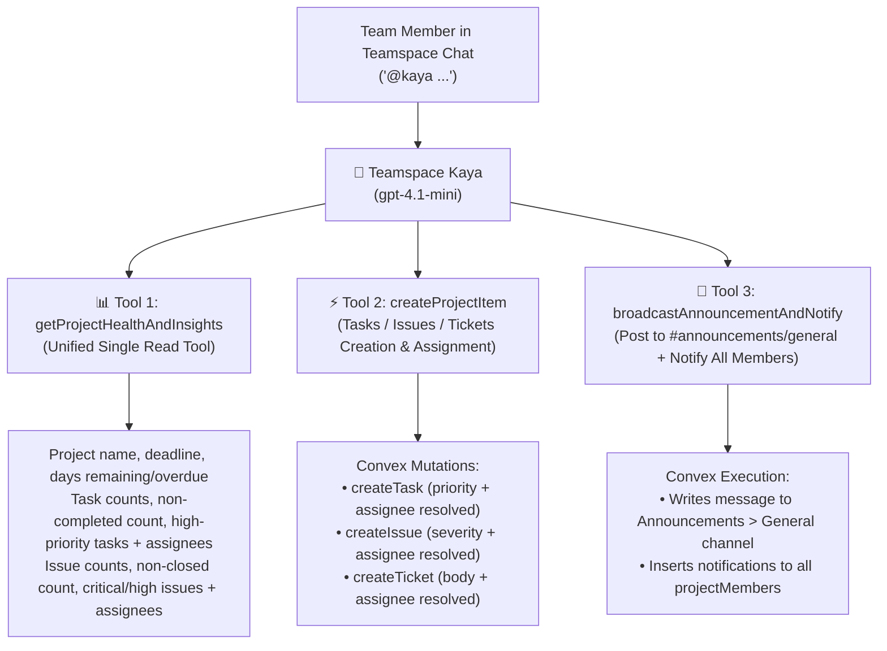

# Teamspace Kaya Architecture & Implementation Plan

This document defines the production specification for **Teamspace Kaya (Autonomous Team Facilitator & Collaborative Co-Pilot)** in Next.js (`/api/kaya-teamspace`) with Convex DB and Vercel AI SDK (`gpt-4.1-mini`).

---

## 🎯 Phase 1: Core 3-Tool System (Immediate Build)



---

## 🛠️ Tool Specifications (Phase 1)

### 1️⃣ Tool 1: `getProjectHealthAndInsights` (Unified Comprehensive Read Tool)

#### Goal:
A single, lightning-fast read tool that retrieves the complete health, deadline, task status, and issue backlog of the project in one roundtrip.

#### Returned Data Payload:
- **Project Basics**:
  - `projectName`: Name of the project.
  - `deadline`: Target deadline timestamp.
  - `daysLeftOrOverdue`: Number of days remaining or days overdue (e.g. `"+5 days remaining"` or `"-3 days OVERDUE"`).
  - `repoConnected`: Name of connected GitHub repository if any.
- **Tasks Breakdown**:
  - `totalTasks`: Total task count.
  - `nonCompletedTasks`: Count of active/in-flight tasks (not in "completed" state).
  - `completedTasks`: Count of completed tasks.
  - `highPriorityTasks`: List of high-priority and urgent tasks with:
    - `title`: Task title.
    - `status`: Current status (`inprogress`, `reviewing`, `testing`, `not started`).
    - `assignees`: Array of assigned member names.
- **Issues Breakdown**:
  - `totalIssues`: Total issues count.
  - `nonClosedIssues`: Count of open/reopened bugs.
  - `closedIssues`: Count of resolved issues.
  - `criticalAndHighIssues`: List of critical/high severity issues with:
    - `title`: Issue title.
    - `severity`: (`critical` | `medium` | `low`).
    - `status`: (`opened` | `reopened` | `not opened`).
    - `environment`: (`production` | `staging` | `dev` | `local`).
    - `assignees`: Array of assigned member names.

#### Example User Invocations:
- *"@kaya project status"*
- *"@kaya what are our current deadlines, active tasks and critical bugs?"*
- *"@kaya give me an overview of high priority items and who is working on them"*

---

### 2️⃣ Tool 2: `createProjectItem` (Universal Task / Issue / Ticket Creator)

#### Goal:
A single, flexible action tool that handles the creation and assignment of **Tasks**, **Issues**, or **Tickets** with fuzzy assignee name matching across the team.

#### Input Schema (`zod`):
```ts
z.object({
  itemType: z.enum(["task", "issue", "ticket"]).describe("The type of item to create"),
  titleOrBody: z.string().describe("The task title, issue title, or ticket description"),
  description: z.optional(z.string()).describe("Detailed description for tasks or issues"),
  priorityOrSeverity: z.optional(z.enum(["critical", "high", "medium", "low"])).describe("Priority for tasks, Severity for issues"),
  assigneeName: z.optional(z.string()).describe("Name or @mention of the team member to assign"),
  environment: z.optional(z.enum(["production", "staging", "dev", "local"])).describe("Environment for issues (defaults to dev)"),
})
```

#### Execution Logic:
1. **Assignee Name Resolution**:
   - Queries `projectMembers` in the current project.
   - Fuzzy-matches `assigneeName` against member `userName` and `email` (e.g. `"rihu"` -> matches `"Rihul"` / `"Rihu Sharma"` -> gets `userId`).
2. **Convex Mutation Dispatch**:
   - **`itemType === "task"`**: Calls `api.tasks.createTask` with `priority` and links the assignee via `taskAssignees`.
   - **`itemType === "issue"`**: Calls `api.issues.createIssue` with `severity`, `environment`, and links assignee via `issueAssignees`.
   - **`itemType === "ticket"`**: Calls `api.workspace.createTicket` with `body`, `assignedTo`, `projectId`.
3. **Response to Chat**:
   - Returns a structured confirmation badge in chat with the created entity ID, assignee mention, and priority pill.

#### Example User Invocations:
- *"@kaya create ticket saying handle client tomorrow, assign to rihu"*
- *"@kaya create high priority task: Implement OAuth2 refresh token handling, assign to Alex"*
- *"@kaya log production issue: Sentry 500 error on payment checkout, assign to Dave"*

---

### 3️⃣ Tool 3: `broadcastAnnouncementAndNotify` (Announcements + Team Broadcast)

#### Goal:
Allows any team member (or PM/Lead) to ask Kaya to broadcast an update to the entire team. Kaya writes the message directly into the **Announcements > General** channel and triggers in-app notifications for every project member.

#### Input Schema (`zod`):
```ts
z.object({
  announcementTitle: z.string().describe("Short punchy headline for the announcement"),
  message: z.string().describe("The full announcement message content to broadcast"),
  priority: z.optional(z.enum(["normal", "urgent"])).describe("Priority level of the broadcast (default normal)"),
})
```

#### Execution Logic:
1. **Locate Announcement Channel**:
   - Finds the channel in the project where `type === "announcement"` (the default `#general` announcement channel).
2. **Publish Message as Kaya**:
   - Inserts the formatted announcement into Convex `messages` table with:
     - `user_id: "kaya"`
     - `user_name: "Kaya"`
     - `user_image: "/kaya.svg"`
     - `content`: Formatted markdown with banner, author attribution (*"Broadcast requested by [User]"*), and timestamp.
3. **Broadcast In-App Notifications to All Members**:
   - Fetches all active `projectMembers` in the project.
   - Inserts notification rows into `notifications` table for every member (excluding sender if desired):
     - `type: "project_alert"`
     - `body`: `📢 [Announcement] ${announcementTitle}: ${message.slice(0, 100)}...`
     - `isRead: false`
4. **Channel Confirmation**:
   - Confirms back in the current channel:
     - *"📢 **Announcement Broadcasted!** Posted to **#general (Announcements)** and sent notifications to **{count} team members**."*

#### Example User Invocations:
- *"@kaya notify all team members about the design review meeting at 4 PM today"*
- *"@kaya announce to team: Code freeze starts today at 6 PM for v2.0 deployment"*

---

## 🔮 Phase 2: Advanced Subagent Tools (Coming Next)

- **Tool 4 (`scheduleMeetupAndTakeaways`)**: Subagent parsing chat discussion, extracting key takeaways, and scheduling calendar syncs.
- **Tool 5 (`extractDiscussionTicketsSubagent`)**: Deep subagent analyzing multi-message channel debates, resolving multi-user consensus, and batch-creating tickets.

---

## 🚀 Ready for Implementation

We are ready to build the **Phase 1 (3 Tools)**:
1. `teamspaceAgents.ts` Convex backend functions for `getProjectHealthAndInsights`, `createProjectItem`, and `broadcastAnnouncementAndNotify`.
2. `/api/kaya-teamspace/route.ts` Next.js route updated with the 3 tool schemas and `gpt-4.1-mini`.
